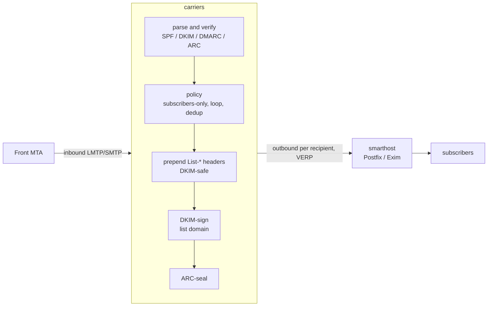

# carriers

A simple mailing list manager written in Rust, built for compliance with **SPF, DKIM, DMARC
and ARC** so that list mail is accepted by large providers (Google, Microsoft, Apple).

carriers is also highly configurable and scriptable: posting/moderation policy, the optional
global and per-domain before/after tiers, and even the built-in loop detection, duplicate
suppression, `List-*` header injection, and DMARC enforcement gate are themselves ordinary
**Sieve** scripts (RFC 5228/5429) — see "Posting policy and moderation", "Global policy", and
"Built-in loop, duplicate, and header scripts" below. The built-in modes are just the shipped
defaults, not a ceiling: an administrator can drop in fully custom `.sieve` logic at nearly every
stage of the pipeline.

## Why DMARC breaks mailing lists — and how carriers stays compliant

A message passes DMARC at the recipient only if an **aligned** authenticator still validates.
Traditional lists break this by editing the body (footers) or the `Subject`, which invalidates
the author's DKIM signature; for domains publishing `p=reject`, the message is then rejected.

carriers avoids that by never modifying a message in a way that breaks DKIM:

1. **Preserve the author's DKIM signature.** The body and existing headers are never rewritten.
   carriers only *prepends* headers, so the author's DKIM signature stays valid and DMARC
   passes at the recipient via **DKIM alignment** (SPF won't align — that is expected and fine).
2. **Add an aligned list DKIM signature** for the list domain.
3. **ARC-seal every message**, recording the SPF/DKIM/DMARC results observed on ingress, so a
   receiver that trusts the sealer can honour the original authentication even if a later hop
   breaks it.
4. **DKIM-breaking features are off by default** (no body footer; the `Subject` prefix is empty
   unless you explicitly opt in and accept it breaks DKIM).

It adds the standard `List-*` headers (RFC 2369), including one-click unsubscribe
(RFC 8058) — all header-only changes that are DKIM-safe.

Built on the battle-tested [Stalwart Labs](https://github.com/orgs/stalwartlabs/repositories)
crates: `mail-auth` (DKIM/SPF/DMARC/ARC), `mail-parser`, `mail-builder`, `mail-send`,
`smtp-proto`, and `sieve`.

## How it compares

|  | carriers | [GNU Mailman 3](https://mailman.readthedocs.io/) | [mlmmj](https://mlmmj.org/) | [Sympa](https://www.sympa.community/) |
| --- | --- | --- | --- | --- |
| Language | Rust | Python | C | Perl |
| License | MPL-2.0 (+ the AGPL-3.0 `sieve-rs` dependency) | GPL-3.0-or-later | MIT | GPL-2.0 |
| Architecture | single binary; SMTP/LMTP listener, relays out via a smarthost | Core + Postorius (web UI) + HyperKitty (archiver), Django/DB-backed | minimal; invoked per message by the local MTA (procmail-style) | full suite: WWSympa web UI plus several daemons, DB-backed |
| Web UI | none (CLI only) | yes (Postorius) | none | yes (WWSympa) |
| Author's original DKIM signature | preserved by design — body and existing headers are never rewritten | broken by default — DMARC mitigation munges `From` or wraps the message | preserved *if* the operator leaves the footer/subject-prefix tunables off | broken when DMARC protection is enabled — it rewrites `From` |
| List's own aligned DKIM signature | built in, automatic | left to the outbound MTA | not provided | built in (`Mail::DKIM`) |
| ARC sealing | built in, automatic | built in (3.3.8+) | not provided | built in, can share the DKIM key |
| Moderation | Sieve scripts (RFC 5228/5429): built-in open/subscribers/posters/moderated modes, or a custom script | rules/chains configured via the DB or web UI | mail-command driven, flat-file config | scenarios configured via the DB or web UI |
| Membership storage | flat-file seed + SQLite | relational DB (Django ORM) | flat text files (mbox-style directories) | relational DB |
| Bounce handling | VERP, automatic scoring and delivery disabling | VERP, bounce processing | VERP, automated bounce handling (`mlmmj-bounce`) | VERP, bounce processing |
| Archiving | not yet — planned (see [Status / roadmap](#status--roadmap)) | yes (HyperKitty) | no (left to external tools) | yes |

Mailman 3 and Sympa are mature, full-featured suites with web UIs, archiving and far more
configurability than carriers currently offers; both also added ARC support to cope with DMARC,
but their default DMARC mitigation still rewrites `From` (breaking the author's own DKIM
signature) rather than preserving it. mlmmj is the closest match in spirit — minimal, mail-only,
config-file driven — and, like carriers, can pass DMARC by leaving messages alone, but it has no
notion of DKIM/ARC itself: getting a signature onto outbound mail is entirely down to how you
configure the surrounding MTA, and there's no aligned list-domain signature or ARC seal. carriers
folds DKIM signing and ARC sealing into the core pipeline itself, so the compliance behavior
doesn't depend on the surrounding MTA setup — at the cost of being the newest and least featureful
project of the four.

## Architecture



- **Ingress**: a minimal LMTP/SMTP listener meant to sit behind a front MTA on a trusted
  interface.
- **Egress**: each copy is relayed to a configured smarthost with a per-recipient **VERP**
  return path (`dev+bounce=user=example.com@lists.example.org`) for bounce attribution. The
  smarthost owns queueing, retries, MX resolution and outbound TLS.
- **Config**: global `carriers.toml` plus one TOML file per list.
- **State**: membership and dedup live in SQLite, behind a `MemberProvider` trait so a future
  pull-based member source can drop in with SQLite as its cache.

The workspace is split into `carriers-core` (the message pipeline, no network) and `carriers`
(the daemon + CLI).

## Quick start

```sh
# 1. Generate DKIM/ARC/DKIM2 keys for the list domain and one DNS zone file covering everything
#    it needs to publish (DKIM, DKIM2, SPF, ARC, DMARC, plus a PTR reminder).
carriers setup lists.example.org --algorithm ed25519 --spf-ip <smarthost-ip> \
    --dmarc-rua dmarc@lists.example.org --out-dir /etc/carriers/keys/dev

# 2. Write config and a list definition (see examples/) — `carriers setup` prints a ready-to-paste
#    [dkim]/[arc]/[dkim2] snippet pointing at the keys it just wrote.
cp examples/carriers.toml   /etc/carriers/carriers.toml
cp examples/lists/dev.toml  /etc/carriers/lists/dev.toml

# 3. Add subscribers.
carriers -c /etc/carriers/carriers.toml member add dev alice@example.com

# 4. Run the daemon.
carriers -c /etc/carriers/carriers.toml run
```

Point your MTA to relay mail for the list address to the carriers `listen` socket (e.g. an LMTP
transport in Postfix), and set carriers' `smarthost` back to that MTA for outbound.

## Running under systemd

Unit files are provided in [`contrib/systemd/`](contrib/systemd/). carriers supports
**socket activation**: when started from a systemd `.socket` unit it adopts the inherited
listening socket, so restarts don't drop the port and the socket can be held open before the
service is ready. Under socket activation the `listen` value in `carriers.toml` is ignored (the
`.socket` unit's `ListenStream=` wins).

```sh
install -Dm755 target/release/carriers /usr/bin/carriers
install -Dm644 contrib/systemd/carriers.socket  /etc/systemd/system/carriers.socket
install -Dm644 contrib/systemd/carriers.service /etc/systemd/system/carriers.service
systemctl daemon-reload
systemctl enable --now carriers.socket carriers.service
```

The service runs as a dynamically allocated user (`DynamicUser=yes`), so there is no `carriers`
user/group to create beforehand.

The service is sandboxed (`ProtectSystem=strict`, a managed `StateDirectory=carriers`, a
system-call filter, etc.); keep `db_path = "/var/lib/carriers/carriers.db"` so the database
lives in the writable state directory, and keep config/keys under `/etc/carriers` (read-only to
the service). Running `carriers run` directly (without systemd) simply binds `listen` itself.

## DNS you must publish

`carriers setup <domain>` writes a single zone file (`<domain>.zone` by default) covering
everything the **list domain** needs:

- **DKIM**, at `<dkim-selector>._domainkey.<list-domain>`.
- **ARC**, at `<arc-selector>._domainkey.<list-domain>`.
- **DKIM2** (see "DKIM2 support" — every list needs this key, the same as DKIM/ARC), at
  `<dkim2-selector>._domainkey.<list-domain>` (same record shape as DKIM).
- **SPF**, from any `--spf-ip` addresses given (repeat the flag for multiple smarthosts/IPv4+IPv6);
  without one, the zone file leaves a placeholder line to fill in.
- **DMARC**, from `--dmarc-policy` (default `quarantine`) and an optional `--dmarc-rua`.
- A **PTR reminder**: reverse DNS for your smarthost's IP lives in that IP's own zone
  (`in-addr.arpa`/`ip6.arpa`), controlled by whoever assigns you the address — not something this
  domain's zone file can publish. The generated file includes a comment with what to ask for.

Publish the file via `$INCLUDE`, or paste its records into your DNS provider's UI. The RSA `p=`
value is emitted as X.509 SubjectPublicKeyInfo (SPKI), the form Google/Microsoft expect.

## Posting policy and moderation

Each list names its moderation policy with a single `policy = "<name>"` field (see
[`examples/lists/dev.toml`](examples/lists/dev.toml)) — either one of the built-in policies, or
the name of a custom `<name>.sieve` file the administrator places in
`sieve_scripts/moderation_policies/` (see
[`examples/sieve_scripts/moderation_policies/`](examples/sieve_scripts/moderation_policies/)).
Both are compiled into the same engine at startup and looked up by the same name — there is no
separate "use a built-in mode" vs. "use a custom script" configuration shape.

| Built-in policy | Who may post directly | Everyone else |
| --- | --- | --- |
| `open` | anyone | — |
| `subscribers` (default) | subscribers (receive the list) | held for moderation |
| `posters` | addresses flagged as posters, independent of subscription (subscribing does not grant posting rights, and being a poster does not imply receiving the list) | held for moderation |
| `moderated` | nobody | held for moderation |

Held posts wait in a per-list queue. Review them with `carriers moderate list`, inspect one with
`carriers moderate show <id>`, then `carriers moderate approve <id>` (distributes it) or
`carriers moderate reject <id>` (discards it). A poster who is not a subscriber is added with
`carriers member add <list> <address> --poster --no-subscribe`.

### Sieve policies

For richer rules, name a custom **Sieve** script instead of a built-in policy: `policy` becomes
the file's name (without extension) and carriers compiles `<name>.sieve` from
`sieve_scripts/moderation_policies/`. Policies are global and static — compiled once at startup.
The script decides with ordinary Sieve actions:

- `keep;` (or an empty script) — **approve** and distribute now
- `fileinto "moderate";` — **hold** for moderation
- `discard;` — silently **discard**: the message is dropped and the sender's SMTP transaction
  is accepted (`250`) as if nothing happened, so a spammer isn't told their mail was noticed
- `reject "…";` / `ereject "…";` — **reject**: the SMTP transaction fails with a `550 5.7.1`
  and the given reason, so a legitimate sender finds out and can act (e.g. ask to subscribe).
  The reason is sanitised before being echoed into the SMTP reply (stripped of CR/LF, length
  capped) since it may indirectly reflect attacker-controlled message content.
- `fileinto :copy "archive";` — **archive** a copy of the message (as received) under
  `archive_dir`, as `<archive_dir>/<list>/<timestamp>-<message-id>.eml`. `fileinto` destinations
  are pseudo-mailboxes, not real folders — `archive` (like `moderate`) is interpreted by name.
  The `:copy` keeps the message flowing, so archiving is a side effect that doesn't itself change
  the decision: put it in a "before" script to capture everything (including posts later
  rejected, handy for debugging) or in an "after" script for a plain archive of what goes out.
  If no `archive_dir` is configured, the `fileinto` is a no-op and logs a warning.

Membership is exposed as Sieve external lists, resolved against the *current* list, so one
global script adapts per mailing list. These are independent flags, not a hierarchy —
`subscribers`, `posters`, and `moderators` (set with `carriers member add … --moderator`) may
overlap arbitrarily or not at all. The list's short name is available as the
`vnd.carriers.list` environment variable. `carriers policies` lists the compiled policies.

```sieve
require ["envelope", "extlists", "fileinto", "reject"];
if address :list "from" "subscribers" { keep; }
elsif address :list "from" "posters"  { fileinto "moderate"; }
else                                  { reject "Only subscribers and posters may write to this list."; }
```

> Note: the Sieve engine ([`sieve-rs`](https://github.com/stalwartlabs/sieve)) is AGPL-3.0, so
> building carriers with policy support links AGPL code into the binary.

The Sieve compile-and-run mechanics (the generic `keep`/`discard`/`reject`/`fileinto` event
loop, list-membership lookups) live in `carriers-core`'s `sieve_engine` module, independent of
mailing-list semantics. `policy` module builds on it: it interprets the engine's outcome into a
`PolicyDecision`, and ships the built-in policies as standalone `<name>.sieve` files (embedded
into the binary at compile time with `include_str!`) rather than inline Rust string literals.

### Built-in loop, duplicate, and header scripts

Several mechanical steps are themselves built-in Sieve scripts (embedded the same way as the
built-in policies):

- **Loop detection** is a header check: `loop.sieve` discards a message that already carries this
  list's own `List-Id` (exposed to the script as the `vnd.carriers.list_id` environment
  variable), meaning it has already been distributed through the list and is looping back.
- **Duplicate detection** uses the standard Sieve `duplicate` extension (RFC 7352):
  `duplicate.sieve` discards a message whose `Message-ID` this list has already seen. The
  seen-`Message-ID` set is stored per list in SQLite; a message with no `Message-ID` is never
  treated as a duplicate.
- **`List-*` header injection** is `list-headers.sieve`: it `addheader`s the List-* headers
  (RFC 2369 + RFC 8058) whose values carriers computes from the list config and passes in as
  environment variables. `addheader` prepends, so the body and existing headers are untouched and
  the author's DKIM signature stays valid. (mail-parser canonicalises the field name `List-Id` to
  `List-ID`; the two are equivalent per RFC 5322.)

Loop and duplicate detection run ahead of the policy chain on every message; the header injection
runs at the very end, just before signing, on a message that is going out.

### DMARC enforcement gate

carriers must never act as an "open relay" for reputation: adding its own valid, aligned DKIM
signature to a message that is itself unauthenticated would let anyone launder a spoofed identity
through the list's sending reputation. Two more built-in scripts close this:

- **`dmarc-before.sieve`** runs first in the "before" chain (ahead of even the global-before
  drop-ins), and **rejects outright** a message that fails DMARC against a domain that requests
  enforcement (`p=quarantine`/`p=reject`) — before it can even reach moderation.
- **`dmarc-after.sieve`** runs first in the "after" chain. It re-checks the same condition
  defensively (a message can sit held for moderation while the author domain's DNS/policy state
  changes), and for a message that still fails DMARC but whose domain does *not* request
  enforcement (no DMARC record published at all, or an explicit `p=none`), it files the message
  into the `no-dkim` pseudo-mailbox: the message is still distributed, but **never carries the
  list's own `DKIM-Signature`** — only the ARC seal, which honestly records what was observed
  rather than lending the message the list's reputation.

Both scripts decide from the same DMARC/DKIM/SPF verdict, computed once per evaluation and exposed
to *every* Sieve tier (not just these two built-ins) as environment variables, so a custom
before/after drop-in can also act on it:

| Variable | Values |
| --- | --- |
| `vnd.carriers.dmarc_pass` | `yes` / `no` — DMARC passed via an aligned DKIM or SPF identity |
| `vnd.carriers.dmarc_policy` | `none` / `quarantine` / `reject` — the domain's requested enforcement (no DMARC record published and an explicit `p=none` both read as `none`) |
| `vnd.carriers.dkim_result` | `pass` / `fail` / `none` / `temperror` / `permerror` — DMARC's DKIM-alignment leg (a passing, aligned DKIM2 chain counts here too) |
| `vnd.carriers.spf_result` | same shape as `dkim_result` — DMARC's SPF-alignment leg |
| `vnd.carriers.dkim1_result` | same shape as `dkim_result` — the raw classic DKIM (RFC 6376) verification result across every signature on the message, independent of DMARC alignment |
| `vnd.carriers.dkim2_result` | same shape as `dkim_result` — the raw DKIM2 chain verification result (see "DKIM2 support" below), independent of DMARC alignment |

This is a hard, unconditional invariant — there is no config toggle to disable it.

**From/Reply-To munging.** A `munge-from` pseudo-mailbox is also available (mailman3's
`munge_from` DMARC mitigation): filing a message into it rewrites `From` to the list's own posting
address (embedding the original sender's name) and `Reply-To` back to the original sender, so a
message can still go out under the list's own aligned identity when its original one can never be
preserved. Nothing built-in requests this yet — it exists as a mechanism for a future feature that
would otherwise break the author's DKIM (e.g. an opt-in `Subject` prefix or footer), or for a
custom script that wants it today.

### DKIM2 support

carriers verifies and signs with **DKIM2**
([draft-ietf-dkim-dkim2-spec](https://datatracker.ietf.org/doc/html/draft-ietf-dkim-dkim2-spec)),
an emerging IETF successor to classic DKIM and ARC that chains signatures across hops while
binding the exact SMTP envelope at each one:

- **Verification** always runs on inbound mail (no config needed): if a message carries a DKIM2
  chain, it's checked alongside classic DKIM/SPF/DMARC, and a passing, aligned chain counts as a
  DMARC DKIM-alignment pass just like classic DKIM would (see `vnd.carriers.dkim2_result` above).
- **Signing is not a config choice** — every list has a `[dkim2]` key configured, the same as
  `[dkim]`/`[arc]` (`carriers setup` always generates it). Whether it's actually used is decided
  per message: carriers only ever **extends** a DKIM2 chain the inbound message already carried
  (`vnd.carriers.dkim2_result` was anything other than `none`); it never originates one of its
  own. Most inbound mail today has no DKIM2 signature at all, so the key simply goes unused for
  it — that's expected, not a misconfiguration.
- When it does apply, because DKIM2's envelope binding must exactly match the real delivery
  envelope — unlike ARC/classic DKIM, which sign once for every recipient — carriers adds the
  list's DKIM2 chain link **once per recipient**, at actual delivery time, bound to that
  subscriber's own VERP return path. Everything else (ARC seal, classic DKIM signature, List
  headers) is still computed once and shared across all copies.
- The `no-dkim` pseudo-mailbox (see above) withholds the DKIM2 chain link too, not just the
  classic DKIM signature.

### Global policy

All of a deployment's Sieve lives under one root directory — `sieve_scripts` in `carriers.toml`
(if unset, a `sieve_scripts` directory next to `carriers.toml` is used automatically). It has a
fixed, auto-discovered layout — nothing else to configure:

```text
sieve_scripts/
  moderation_policies/<name>.sieve    # per-list moderation policies, named by file stem;
                                      # referenced by a list's `policy = "<name>"`
  before.d/*.sieve                    # global "before" drop-ins
  after.d/*.sieve                     # global "after" drop-ins
  domains/<domain>/before.d/*.sieve   # per-domain before
  domains/<domain>/after.d/*.sieve    # per-domain after
```

The named **moderation policies** are what a list's `policy` field selects (a built-in name, or a
custom `<name>.sieve` here). The **drop-in directories** hold optional Sieve that runs wrapped
around every list's own policy — right after loop and duplicate detection, so they still have
access to the current list's membership sets, same as a per-list script. Each is a **`.d` drop-in
directory**: every `*.sieve` file directly inside it runs, in filename order (like a systemd
drop-in directory), so you can layer rules by dropping in numbered files (`10-abuse.sieve`,
`20-archive.sieve`, …). There are two axes:

- **before / after**: `before` scripts run at intake, ahead of the list's own policy, and help
  decide moderation. `after` scripts run later — at distribution time, *after* any moderation —
  as a final gate on a message that is actually about to go out.
- **instance-wide / per-domain**: `before.d`/`after.d` apply to *every* list regardless of domain;
  `domains/<domain>/{before,after}.d` add another before/after pair that only applies to lists
  whose posting address is under that one domain.

The full chain, for a list under a domain that has its own entry (each stage below being a whole
drop-in directory, its scripts run in order):

```text
# at intake:                                    # at distribution (after moderation):
global before -> domain before -> list policy   ...  domain after -> global after
```

The two halves run at different moments. The **before** half (global before, domain before, the
list's own policy) is evaluated when the message arrives, and decides whether to distribute it
now, hold it for moderation, discard it, or reject it. The **after** half (domain after, global
after) runs from `finalize` — for a message approved outright *or* one a moderator later
approves — so it always gets the last word on what actually leaves the server.

Any subdirectory that is absent (or empty) is simply skipped — everything under `sieve_scripts` is
optional and auto-discovered, so there is nothing to wire up per directory. See the example
[`examples/sieve_scripts/`](examples/sieve_scripts) tree: a custom moderation policy
([`moderation_policies/moderated-posters.sieve`](examples/sieve_scripts/moderation_policies/moderated-posters.sieve)),
an instance-wide before drop-in ([`before.d/`](examples/sieve_scripts/before.d)), an instance-wide
after drop-in ([`after.d/`](examples/sieve_scripts/after.d)), and a domain-scoped after directory
for `lists.example.com`
([`domains/lists.example.com/after.d/`](examples/sieve_scripts/domains/lists.example.com/after.d)).

At every step, an implicit keep (nothing in the script matched) is *not* authoritative — it just
means that script found no reason to act, so whatever was decided so far (`Approve`, unless an
earlier step already decided otherwise) carries through unchanged. An explicit
`fileinto "moderate"`, `discard`, or `reject` *is* authoritative and becomes the new decision so
far. There is deliberately no way for a `before` script to force an *approval* that bypasses the
list's own policy — only to hold, discard, or reject ahead of it — since an ordinary
`keep`/implicit-keep already means "no opinion," and giving it a second, authoritative meaning
would make an empty or narrowly-scoped script silently approve everything it doesn't otherwise
mention.

Within the before half, once a step reaches `discard` or `reject` the rest of that half is
skipped, and a `before` script's `fileinto "moderate"` skips straight to holding the message (the
list's own policy has nothing to add once it's already held). The after half then runs later,
from `finalize`, starting fresh from an approval — so even a message that was held and then
approved by a moderator still passes through the `after` scripts, which can tighten it to a hold,
discard, or reject. That is what makes `after` the place for last-word, domain- or instance-wide
checks (e.g. a compliance rule that must win regardless of what any single list's policy, or
moderator, decided).

### Debugging a policy offline with `carriers-sieve`

Writing or changing a policy script shouldn't mean standing up the whole daemon to see what it
does. The `carriers-sieve` dev crate (`crates/carriers-sieve`) runs a single Sieve policy against
real messages on the command line and prints the decision it reaches — approve, moderate, discard,
or reject — using the daemon's own evaluation logic, so the answer matches what a list would do.

```sh
# Run a policy against one message, supplying the envelope sender and membership lists the
# script's :list tests need. Inputs can be .eml files, a directory of them, or an mbox file
# (the format Thunderbird uses for local folders) — each contained message is evaluated.
$ cargo run -p carriers-sieve -- \
    examples/sieve_scripts/moderation_policies/moderated-posters.sieve message.eml \
    --mail-from poster@example.com \
    --list subscribers=alice@example.com --list posters=poster@example.com

# Environment items scripts test via the "environment" extension (e.g. the vnd.carriers.dmarc_*
# facts) come from the process environment by default and/or explicit --env flags:
$ cargo run -p carriers-sieve -- policy.sieve message.eml --env vnd.carriers.dmarc_pass=false

# --trace additionally lists every action the script performed, in order (keep, fileinto,
# redirect, notify, envelope edits) and — when it edited headers — exactly which headers changed:
$ cargo run -p carriers-sieve -- policy.sieve message.eml --trace
message.eml: moderate  [archive]
    actions:
      edited message headers
      fileinto "archive"
      redirect audit@example.com
      fileinto "moderate"
    header changes:
      + X-Carriers-Debug: traced
      - X-Spam-Flag: NO
```

Because the process environment is fed into the Sieve environment, a policy script can also be made
directly runnable with a shebang — the `#!` line is an ordinary Sieve comment, so the same file is
both a valid policy and an executable (`--exit-code` maps the decision to the process status):

```sieve
#!/usr/bin/env -S carriers-sieve --list-name announce --list posters=poster@example.com
require ["envelope", "extlists", "reject"];
if address :list "from" "posters" { keep; } else { reject "posters only"; }
```

```sh
$ chmod +x announce.sieve && ./announce.sieve message.eml   # with carriers-sieve on $PATH
```

## Bounce handling

Every delivered copy carries a per-recipient VERP return path
(`dev+bounce=user=example.com@lists.example.org`), so a delivery failure produces a DSN
addressed back to the failing subscriber. carriers recognises those bounce addresses on ingress,
classifies the DSN (permanent `5.x.x` vs transient `4.x.x`), and adds a weight to the
subscriber's running bounce score. When the score reaches the configured `threshold` (see the
`[bounce]` section of [`examples/carriers.toml`](examples/carriers.toml)), delivery to that
address is disabled — it is skipped as a recipient — until an operator runs
`carriers member enable <list> <address>`, which clears the score and restores delivery.
`carriers member list` shows the current bounce score and disabled state.

## CLI

| Command | Description |
| --- | --- |
| `carriers run` | Run the ingress listener and distribute posts. |
| `carriers setup <domain>` | Generate DKIM/ARC/DKIM2 keys and one DNS zone file with everything a list domain needs to publish (DKIM, DKIM2, SPF, ARC, DMARC, plus a PTR reminder). |
| `carriers member add\|remove\|list\|enable <list> [address] [--poster] [--no-subscribe] [--moderator]` | Manage members; `enable` clears bounce state. |
| `carriers moderate list\|show\|approve\|reject [id]` | Review and act on held messages. |
| `carriers policies` | List the compiled Sieve moderation policies. |
| `carriers sync` | Import each list's flat `members_file` into SQLite. |

## Local testing harness

The `carriers-testkit` dev crate (`crates/carriers-testkit`) stands up a complete, throwaway
mail world **in a single process** so you can watch how real messages fare end to end — the one
thing unit tests can't show you: what a subscriber's server actually concludes about a delivered
copy. It wires together three mocks and the *real* daemon:

- a **mock authoritative DNS server**, driven by a zone file, that publishes the author's and the
  list's DKIM/ARC keys plus their SPF and DMARC records (so verification resolves offline);
- the **real carriers daemon**, run in-process as a task, with its DNS resolver injected
  (`AppState::load` takes a `MessageAuthenticator`) so it points at the mock DNS;
- a **capturing, scoring SMTP sink** in place of subscribers' servers: every delivered copy is
  written to `captured/<n>.eml` and scored with `mail-auth` exactly as a receiving MTA would —
  DKIM (per signature), ARC (`cv`), SPF, and the overall DMARC verdict with its aligned identity;
- a **sender** that either crafts a message (optionally DKIM-signing it as the author, the way a
  real MUA would) or replays an existing `.eml` verbatim.

```console
# Run the built-in scenarios with assertions (exits non-zero on any mismatch):
$ cargo run -p carriers-testkit -- scenario --all

=== scenario: author-signed-preject ===
  delivered: dmarc=pass (dkim-align=pass, spf-align=fail) | dkim-pass=[lists.example.org+example.com] | arc=pass | ...
  [OK  ] author DKIM survives (want yes, got yes)
  [OK  ] list DKIM valid (want yes, got yes)
  [OK  ] ARC cv=pass (want yes, got yes)
  [OK  ] DMARC via DKIM alignment (want yes, got yes)
  [OK  ] DMARC pass overall (want yes, got yes)
  result: PASS
```

The bundled scenarios are `author-signed-preject` (a validly author-signed post from a `p=reject`
domain — the core guarantee: the author's DKIM survives and DMARC passes via DKIM alignment at the
subscriber), `no-dkim` (an unsigned post — the author domain can *not* pass DMARC via DKIM, only
the list's own DKIM + ARC are valid), `replay-eml` (an existing message from
`examples/testkit/messages/` replayed verbatim), `dmarc-reject-spoofed` (a spoofed identity
claiming a `p=reject` domain with no valid authentication at all — the built-in DMARC gate must
reject it at the SMTP level, before it can be signed and relayed with the list's reputation), and
`dmarc-none-no-signature` (a domain with no DMARC/DKIM/SPF configured — the message is still
distributed, but the delivered copy must carry no list DKIM signature, only the ARC seal),
`dkim2-signing` (an inbound message that already carries a DKIM2 signature — the list extends the
chain, and the delivered copy's DKIM2 link must verify against the exact per-recipient VERP
delivery envelope it was signed with), and `dkim2-not-originated` (an ordinary message with no
DKIM2 signature of its own — the list must *not* originate a chain, even though it has a `[dkim2]`
key configured).

For interactive poking, bring the stack up and drive it by hand:

```console
$ cargo run -p carriers-testkit -- up          # prints the ingress port + ready-to-copy send lines
# then, in another shell, inject a signed post or replay a real message:
$ cargo run -p carriers-testkit -- send --ingress 127.0.0.1:<port> --sign --author-key <path> ...
$ cargo run -p carriers-testkit -- send --ingress 127.0.0.1:<port> --eml some-message.eml
```

Delivered copies are scored live as they arrive. The harness only touches loopback and a temp
directory; nothing leaves the machine.

## Status / roadmap

Implemented: LMTP/SMTP ingress, per-list posting policies with message moderation (built-in
open / subscribers / posters / moderated modes, or a Sieve script), optional instance-wide and
per-domain Sieve `.d` drop-in directories wrapped before/after every list's own policy, on-disk
`.eml` archiving (`fileinto :copy "archive"`), a built-in DMARC enforcement gate that rejects
unauthenticated mail against an enforcing domain and withholds the list's own DKIM signature
otherwise (see "DMARC enforcement gate" above), an available From/Reply-To munging mechanism
(`fileinto "munge-from"`), VERP bounce processing with automatic delivery disabling, loop and
duplicate suppression, `List-*` headers, aligned DKIM signing, ARC sealing, DKIM2
verification/chain-extension (see "DKIM2 support"), smarthost delivery, flat-file lists + SQLite
membership (independent subscriber, poster and moderator roles), key generation, an
in-process end-to-end test harness (`carriers-testkit`) with mock DNS + a scoring SMTP sink, and
an offline policy runner (`carriers-sieve`) that evaluates a Sieve policy against `.eml`/mbox
messages from the command line or as a script shebang (see "Debugging a policy offline" above).

Deferred / ideas:

- STARTTLS / implicit TLS on the listener
- direct-to-MX delivery (its own retry queue) instead of a smarthost
- a REST / pull-based member API
- message archiving: on-disk `.eml` archiving is implemented (`fileinto :copy "archive"` writes
  each post under a per-list subdirectory — see "Posting policy and moderation"). Still open: a
  search index (full-text over headers/body) for retrieval, and a web archive layered on top
- opt-in `Subject`-prefix / footer support — for cases where it would break the author's DKIM,
  the `munge-from` mechanism (see "DMARC enforcement gate") exists precisely to let a message
  still go out under the list's own aligned identity instead
- richer policy context exposed to scripts: DMARC/DKIM/SPF results are now exposed (see "DMARC
  enforcement gate"); still open: spam-filter results, message size
- custom Sieve functions registered via the runtime builder's `with_functions`, so policy
  scripts can call carriers-provided helpers — e.g. stripping an attachment, checking a value
  against an external service, or rewriting a header
- a further, list-independent Sieve tier that runs *before* a message is even matched to a list
  (upstream of loop/duplicate detection and the before/after tiers described above), for checks
  that don't need list membership at all — e.g. rejecting anything over a given size regardless
  of which list it's addressed to. Unlike those tiers, this would currently need some
  refactoring: the loop that receives a message and figures out which list it's for lives in the
  `carriers` binary crate's SMTP listener, not `carriers-core`, so this tier has no natural home
  yet
- bounce probing (à la Mailman): periodically send a probe message to a bouncing subscriber to
  distinguish a list-specific block (e.g. the recipient's spam filter rejecting only list mail)
  from a wholesale block of the sending software (e.g. IP-reputation problems). A failed probe
  is a stronger signal about that subscriber and should be weighted higher than an ordinary
  bounce to a list post
- add CI, including [REUSE](https://reuse.software/) license-compliance checking (`reuse lint`)
  to keep licensing machine-readable and consistent (esp. given the MPL-2.0 project vs the
  AGPL-3.0 `sieve-rs` dependency)
- Add Markdown formatter/linter for README
- actually *handle* one-click unsubscribe (RFC 8058), not just advertise it: carriers emits
  `List-Unsubscribe`/`List-Unsubscribe-Post` today, but processing the click is left entirely
  to whatever `unsubscribe_oneclick` URL the admin points at. Implement it end to end via
  either a `mailto:` target carriers listens on itself, or a minimal HTTP endpoint that accepts
  the RFC 8058 POST — routed through `MemberProvider` (an `unsubscribe`-style method) so it
  works uniformly against SQLite today and a future pull-based provider without special-casing
- Support libeconf/UAPI style configuration (merging, overwriting, drop-ins etc)
- Per-domain drop-ins are now auto-discovered under `sieve_scripts/domains/<domain>/` (no manual
  path config). A natural extension would be a reverse-domain *hierarchy*, e.g.
  `sieve_scripts/domains/com/example/before.d/`, so a rule placed at `com/example` applies to
  `example.com` *and all its subdomains* (`lists.example.com`, …) by inheritance — today each
  domain is matched exactly.

## License

MPL-2.0.
