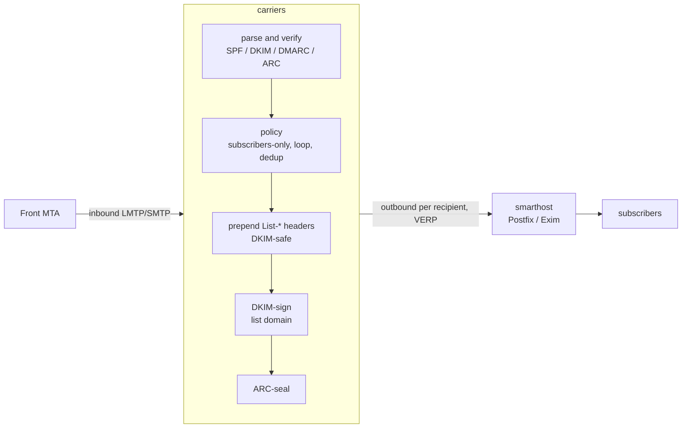

# carriers

A simple mailing list manager written in Rust, built for compliance with **SPF, DKIM, DMARC
and ARC** so that list mail is accepted by large providers (Google, Microsoft, Apple).

## Why DMARC breaks mailing lists — and how carriers stays compliant

A message passes DMARC at the recipient only if an **aligned** authenticator still validates.
Traditional lists break this by editing the body (footers) or the `Subject`, which invalidates
the author's DKIM signature; for domains publishing `p=reject`, the message is then rejected.

carriers avoids that by never modifying a message in a way that breaks DKIM:

1. **Preserve the author's DKIM signature.** The body and existing headers are never rewritten.
   carriers only *prepends* headers, so the author's DKIM signature stays valid and DMARC
   passes at the recipient via **DKIM alignment** (SPF won't align — that is expected and fine).
2. **Add an aligned list DKIM signature** for the list domain.
3. **ARC-seal every message**, recording the SPF/DKIM/DMARC results observed on ingress, so a
   receiver that trusts the sealer can honour the original authentication even if a later hop
   breaks it.
4. **DKIM-breaking features are off by default** (no body footer; the `Subject` prefix is empty
   unless you explicitly opt in and accept it breaks DKIM).

It adds the standard `List-*` headers (RFC 2369), including one-click unsubscribe
(RFC 8058) — all header-only changes that are DKIM-safe.

Built on the battle-tested [Stalwart Labs](https://github.com/orgs/stalwartlabs/repositories)
crates: `mail-auth` (DKIM/SPF/DMARC/ARC), `mail-parser`, `mail-builder`, `mail-send`,
`smtp-proto`, and `sieve`.

## How it compares

|  | carriers | [GNU Mailman 3](https://mailman.readthedocs.io/) | [mlmmj](https://mlmmj.org/) | [Sympa](https://www.sympa.community/) |
| --- | --- | --- | --- | --- |
| Language | Rust | Python | C | Perl |
| License | MPL-2.0 (+ the AGPL-3.0 `sieve-rs` dependency) | GPL-3.0-or-later | MIT | GPL-2.0 |
| Architecture | single binary; SMTP/LMTP listener, relays out via a smarthost | Core + Postorius (web UI) + HyperKitty (archiver), Django/DB-backed | minimal; invoked per message by the local MTA (procmail-style) | full suite: WWSympa web UI plus several daemons, DB-backed |
| Web UI | none (CLI only) | yes (Postorius) | none | yes (WWSympa) |
| Author's original DKIM signature | preserved by design — body and existing headers are never rewritten | broken by default — DMARC mitigation munges `From` or wraps the message | preserved *if* the operator leaves the footer/subject-prefix tunables off | broken when DMARC protection is enabled — it rewrites `From` |
| List's own aligned DKIM signature | built in, automatic | left to the outbound MTA | not provided | built in (`Mail::DKIM`) |
| ARC sealing | built in, automatic | built in (3.3.8+) | not provided | built in, can share the DKIM key |
| Moderation | Sieve scripts (RFC 5228/5429): built-in open/subscribers/posters/moderated modes, or a custom script | rules/chains configured via the DB or web UI | mail-command driven, flat-file config | scenarios configured via the DB or web UI |
| Membership storage | flat-file seed + SQLite | relational DB (Django ORM) | flat text files (mbox-style directories) | relational DB |
| Bounce handling | VERP, automatic scoring and delivery disabling | VERP, bounce processing | VERP, automated bounce handling (`mlmmj-bounce`) | VERP, bounce processing |
| Archiving | not yet — planned (see [Status / roadmap](#status--roadmap)) | yes (HyperKitty) | no (left to external tools) | yes |

Mailman 3 and Sympa are mature, full-featured suites with web UIs, archiving and far more
configurability than carriers currently offers; both also added ARC support to cope with DMARC,
but their default DMARC mitigation still rewrites `From` (breaking the author's own DKIM
signature) rather than preserving it. mlmmj is the closest match in spirit — minimal, mail-only,
config-file driven — and, like carriers, can pass DMARC by leaving messages alone, but it has no
notion of DKIM/ARC itself: getting a signature onto outbound mail is entirely down to how you
configure the surrounding MTA, and there's no aligned list-domain signature or ARC seal. carriers
folds DKIM signing and ARC sealing into the core pipeline itself, so the compliance behavior
doesn't depend on the surrounding MTA setup — at the cost of being the newest and least featureful
project of the four.

## Architecture



- **Ingress**: a minimal LMTP/SMTP listener meant to sit behind a front MTA on a trusted
  interface.
- **Egress**: each copy is relayed to a configured smarthost with a per-recipient **VERP**
  return path (`dev+bounce=user=example.com@lists.example.org`) for bounce attribution. The
  smarthost owns queueing, retries, MX resolution and outbound TLS.
- **Config**: global `carriers.toml` plus one TOML file per list.
- **State**: membership and dedup live in SQLite, behind a `MemberProvider` trait so a future
  pull-based member source can drop in with SQLite as its cache.

The workspace is split into `carriers-core` (the message pipeline, no network) and `carriers`
(the daemon + CLI).

## Quick start

```sh
# 1. Generate DKIM and ARC keys for the list domain (prints the DNS records to publish).
carriers genkey --algorithm ed25519 --selector dkim --domain lists.example.org --out /etc/carriers/keys/dev.dkim.der
carriers genkey --algorithm ed25519 --selector arc  --domain lists.example.org --out /etc/carriers/keys/dev.arc.der

# 2. Write config and a list definition (see examples/).
cp examples/carriers.toml   /etc/carriers/carriers.toml
cp examples/lists/dev.toml  /etc/carriers/lists/dev.toml

# 3. Add subscribers.
carriers -c /etc/carriers/carriers.toml member add dev alice@example.com

# 4. Run the daemon.
carriers -c /etc/carriers/carriers.toml run
```

Point your MTA to relay mail for the list address to the carriers `listen` socket (e.g. an LMTP
transport in Postfix), and set carriers' `smarthost` back to that MTA for outbound.

## Running under systemd

Unit files are provided in [`contrib/systemd/`](contrib/systemd/). carriers supports
**socket activation**: when started from a systemd `.socket` unit it adopts the inherited
listening socket, so restarts don't drop the port and the socket can be held open before the
service is ready. Under socket activation the `listen` value in `carriers.toml` is ignored (the
`.socket` unit's `ListenStream=` wins).

```sh
install -Dm755 target/release/carriers /usr/bin/carriers
install -Dm644 contrib/systemd/carriers.socket  /etc/systemd/system/carriers.socket
install -Dm644 contrib/systemd/carriers.service /etc/systemd/system/carriers.service
systemctl daemon-reload
systemctl enable --now carriers.socket carriers.service
```

The service runs as a dynamically allocated user (`DynamicUser=yes`), so there is no `carriers`
user/group to create beforehand.

The service is sandboxed (`ProtectSystem=strict`, a managed `StateDirectory=carriers`, a
system-call filter, etc.); keep `db_path = "/var/lib/carriers/carriers.db"` so the database
lives in the writable state directory, and keep config/keys under `/etc/carriers` (read-only to
the service). Running `carriers run` directly (without systemd) simply binds `listen` itself.

## DNS you must publish

For the **list domain** (e.g. `lists.example.org`):

- **DKIM**: the TXT record printed by `carriers genkey` at
  `<dkim-selector>._domainkey.<list-domain>`.
- **ARC**: the TXT record printed by `carriers genkey` at
  `<arc-selector>._domainkey.<list-domain>`.
- **SPF**: authorize your smarthost to send for the list domain, e.g.
  `v=spf1 ip4:<smarthost-ip> -all`.
- **DMARC**: e.g. `v=DMARC1; p=quarantine; rua=mailto:dmarc@lists.example.org`.

The RSA `p=` value is emitted as X.509 SubjectPublicKeyInfo (SPKI), the form Google/Microsoft
expect.

## Posting policy and moderation

Each list names its moderation policy with a single `policy = "<name>"` field (see
[`examples/lists/dev.toml`](examples/lists/dev.toml)) — either one of the built-in policies, or
the name of a custom `<name>.sieve` file the administrator places in `policies_dir` (see
[`examples/policies/`](examples/policies/)). Both are compiled into the same engine at startup
and looked up by the same name — there is no separate "use a built-in mode" vs. "use a custom
script" configuration shape.

| Built-in policy | Who may post directly | Everyone else |
| --- | --- | --- |
| `open` | anyone | — |
| `subscribers` (default) | subscribers (receive the list) | held for moderation |
| `posters` | addresses flagged as posters, independent of subscription (subscribing does not grant posting rights, and being a poster does not imply receiving the list) | held for moderation |
| `moderated` | nobody | held for moderation |

Held posts wait in a per-list queue. Review them with `carriers moderate list`, inspect one with
`carriers moderate show <id>`, then `carriers moderate approve <id>` (distributes it) or
`carriers moderate reject <id>` (discards it). A poster who is not a subscriber is added with
`carriers member add <list> <address> --poster --no-subscribe`.

### Sieve policies

For richer rules, name a custom **Sieve** script instead of a built-in policy: `policy` becomes
the file's name (without extension) and carriers compiles `<name>.sieve` from `policies_dir`.
Policies are global and static — compiled once at startup. The script decides with ordinary
Sieve actions:

- `keep;` (or an empty script) — **approve** and distribute now
- `fileinto "moderate";` — **hold** for moderation
- `discard;` — silently **discard**: the message is dropped and the sender's SMTP transaction
  is accepted (`250`) as if nothing happened, so a spammer isn't told their mail was noticed
- `reject "…";` / `ereject "…";` — **reject**: the SMTP transaction fails with a `550 5.7.1`
  and the given reason, so a legitimate sender finds out and can act (e.g. ask to subscribe).
  The reason is sanitised before being echoed into the SMTP reply (stripped of CR/LF, length
  capped) since it may indirectly reflect attacker-controlled message content.

Membership is exposed as Sieve external lists, resolved against the *current* list, so one
global script adapts per mailing list. These are independent flags, not a hierarchy —
`subscribers`, `posters`, and `moderators` (set with `carriers member add … --moderator`) may
overlap arbitrarily or not at all. The list's short name is available as the
`vnd.carriers.list` environment variable. `carriers policies` lists the compiled policies.

```sieve
require ["envelope", "extlists", "fileinto", "reject"];
if address :list "from" "subscribers" { keep; }
elsif address :list "from" "posters"  { fileinto "moderate"; }
else                                  { reject "Only subscribers and posters may write to this list."; }
```

> Note: the Sieve engine ([`sieve-rs`](https://github.com/stalwartlabs/sieve)) is AGPL-3.0, so
> building carriers with policy support links AGPL code into the binary.

The Sieve compile-and-run mechanics (the generic `keep`/`discard`/`reject`/`fileinto` event
loop, list-membership lookups) live in `carriers-core`'s `sieve_engine` module, independent of
mailing-list semantics. `policy` module builds on it: it interprets the engine's outcome into a
`PolicyDecision`, and ships the built-in policies as standalone `<name>.sieve` files (embedded
into the binary at compile time with `include_str!`) rather than inline Rust string literals.

## Bounce handling

Every delivered copy carries a per-recipient VERP return path
(`dev+bounce=user=example.com@lists.example.org`), so a delivery failure produces a DSN
addressed back to the failing subscriber. carriers recognises those bounce addresses on ingress,
classifies the DSN (permanent `5.x.x` vs transient `4.x.x`), and adds a weight to the
subscriber's running bounce score. When the score reaches the configured `threshold` (see the
`[bounce]` section of [`examples/carriers.toml`](examples/carriers.toml)), delivery to that
address is disabled — it is skipped as a recipient — until an operator runs
`carriers member enable <list> <address>`, which clears the score and restores delivery.
`carriers member list` shows the current bounce score and disabled state.

## CLI

| Command | Description |
| --- | --- |
| `carriers run` | Run the ingress listener and distribute posts. |
| `carriers genkey` | Generate a DKIM/ARC key pair and print the DNS record. |
| `carriers member add\|remove\|list\|enable <list> [address] [--poster] [--no-subscribe] [--moderator]` | Manage members; `enable` clears bounce state. |
| `carriers moderate list\|show\|approve\|reject [id]` | Review and act on held messages. |
| `carriers policies` | List the compiled Sieve moderation policies. |
| `carriers sync` | Import each list's flat `members_file` into SQLite. |

## Status / roadmap

Implemented: LMTP/SMTP ingress, per-list posting policies with message moderation (built-in
open / subscribers / posters / moderated modes, or a Sieve script), VERP bounce processing with
automatic delivery disabling, loop and duplicate suppression, `List-*` headers, aligned DKIM
signing, ARC sealing, smarthost delivery, flat-file lists + SQLite membership (independent
subscriber, poster and moderator roles), key generation.

Deferred / ideas:

- STARTTLS / implicit TLS on the listener
- direct-to-MX delivery (its own retry queue) instead of a smarthost
- a REST / pull-based member API
- message archiving: store each distributed post as an `.eml` file on disk under a per-list
  subdirectory, with a search index (full-text over headers/body) for retrieval; a web archive
  could be layered on top
- opt-in `Subject`-prefix / footer support
- per-list (rather than global) Sieve policies, and richer policy context (spam/DKIM results,
  message size) exposed to scripts
- custom Sieve functions registered via the runtime builder's `with_functions`, so policy
  scripts can call carriers-provided helpers — e.g. stripping an attachment, checking a value
  against an external service, or rewriting a header
- bounce probing (à la Mailman): periodically send a probe message to a bouncing subscriber to
  distinguish a list-specific block (e.g. the recipient's spam filter rejecting only list mail)
  from a wholesale block of the sending software (e.g. IP-reputation problems). A failed probe
  is a stronger signal about that subscriber and should be weighted higher than an ordinary
  bounce to a list post
- add CI, including [REUSE](https://reuse.software/) license-compliance checking (`reuse lint`)
  to keep licensing machine-readable and consistent (esp. given the MPL-2.0 project vs the
  AGPL-3.0 `sieve-rs` dependency)
- actually *handle* one-click unsubscribe (RFC 8058), not just advertise it: carriers emits
  `List-Unsubscribe`/`List-Unsubscribe-Post` today, but processing the click is left entirely
  to whatever `unsubscribe_oneclick` URL the admin points at. Implement it end to end via
  either a `mailto:` target carriers listens on itself, or a minimal HTTP endpoint that accepts
  the RFC 8058 POST — routed through `MemberProvider` (an `unsubscribe`-style method) so it
  works uniformly against SQLite today and a future pull-based provider without special-casing

## License

MPL-2.0.
