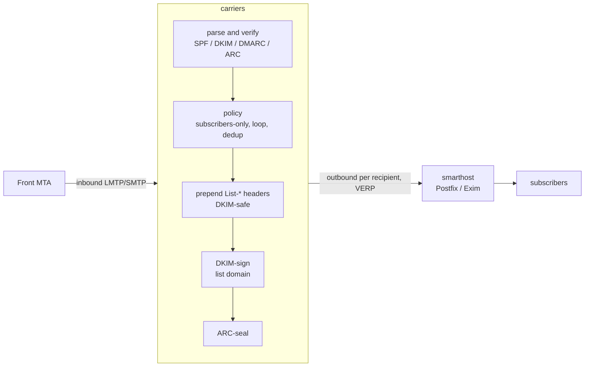

# carriers

A simple mailing list manager written in Rust, built for compliance with **SPF, DKIM, DMARC
and ARC** so that list mail is accepted by large providers (Google, Microsoft, Apple).

## Why DMARC breaks mailing lists — and how carriers stays compliant

A message passes DMARC at the recipient only if an **aligned** authenticator still validates.
Traditional lists break this by editing the body (footers) or the `Subject`, which invalidates
the author's DKIM signature; for domains publishing `p=reject`, the message is then rejected.

carriers avoids that by never modifying a message in a way that breaks DKIM:

1. **Preserve the author's DKIM signature.** The body and existing headers are never rewritten.
   carriers only *prepends* headers, so the author's DKIM signature stays valid and DMARC
   passes at the recipient via **DKIM alignment** (SPF won't align — that is expected and fine).
2. **Add an aligned list DKIM signature** for the list domain.
3. **ARC-seal every message**, recording the SPF/DKIM/DMARC results observed on ingress, so a
   receiver that trusts the sealer can honour the original authentication even if a later hop
   breaks it.
4. **DKIM-breaking features are off by default** (no body footer; the `Subject` prefix is empty
   unless you explicitly opt in and accept it breaks DKIM).

It adds the standard `List-*` headers (RFC 2369), including one-click unsubscribe
(RFC 8058) — all header-only changes that are DKIM-safe.

Built on the battle-tested [Stalwart Labs](https://github.com/orgs/stalwartlabs/repositories)
crates: `mail-auth` (DKIM/SPF/DMARC/ARC), `mail-parser`, `mail-builder`, `mail-send`, and
`smtp-proto`.

## Architecture



- **Ingress**: a minimal LMTP/SMTP listener meant to sit behind a front MTA on a trusted
  interface.
- **Egress**: each copy is relayed to a configured smarthost with a per-recipient **VERP**
  return path (`dev+bounce=user=example.com@lists.example.org`) for bounce attribution. The
  smarthost owns queueing, retries, MX resolution and outbound TLS.
- **Config**: global `carriers.toml` plus one TOML file per list.
- **State**: membership and dedup live in SQLite, behind a `MemberProvider` trait so a future
  pull-based member source can drop in with SQLite as its cache.

The workspace is split into `carriers-core` (the message pipeline, no network) and `carriers`
(the daemon + CLI).

## Quick start

```sh
# 1. Generate DKIM and ARC keys for the list domain (prints the DNS records to publish).
carriers genkey --algorithm ed25519 --selector dkim --domain lists.example.org --out /etc/carriers/keys/dev.dkim.pem
carriers genkey --algorithm ed25519 --selector arc  --domain lists.example.org --out /etc/carriers/keys/dev.arc.pem

# 2. Write config and a list definition (see examples/).
cp examples/carriers.toml   /etc/carriers/carriers.toml
cp examples/lists/dev.toml  /etc/carriers/lists/dev.toml

# 3. Add subscribers.
carriers -c /etc/carriers/carriers.toml member add dev alice@example.com

# 4. Run the daemon.
carriers -c /etc/carriers/carriers.toml run
```

Point your MTA to relay mail for the list address to the carriers `listen` socket (e.g. an LMTP
transport in Postfix), and set carriers' `smarthost` back to that MTA for outbound.

## Running under systemd

Unit files are provided in [`contrib/systemd/`](contrib/systemd/). carriers supports
**socket activation**: when started from a systemd `.socket` unit it adopts the inherited
listening socket, so restarts don't drop the port and the socket can be held open before the
service is ready. Under socket activation the `listen` value in `carriers.toml` is ignored (the
`.socket` unit's `ListenStream=` wins).

```sh
install -Dm755 target/release/carriers /usr/bin/carriers
install -Dm644 contrib/systemd/carriers.socket  /etc/systemd/system/carriers.socket
install -Dm644 contrib/systemd/carriers.service /etc/systemd/system/carriers.service
useradd --system --no-create-home --shell /usr/sbin/nologin carriers
systemctl daemon-reload
systemctl enable --now carriers.socket carriers.service
```

The service is sandboxed (`ProtectSystem=strict`, a managed `StateDirectory=carriers`, a
system-call filter, etc.); keep `db_path = "/var/lib/carriers/carriers.db"` so the database
lives in the writable state directory, and keep config/keys under `/etc/carriers` (read-only to
the service). Running `carriers run` directly (without systemd) simply binds `listen` itself.

## DNS you must publish

For the **list domain** (e.g. `lists.example.org`):

- **DKIM**: the TXT record printed by `carriers genkey` at
  `<dkim-selector>._domainkey.<list-domain>`.
- **ARC**: the TXT record printed by `carriers genkey` at
  `<arc-selector>._domainkey.<list-domain>`.
- **SPF**: authorize your smarthost to send for the list domain, e.g.
  `v=spf1 ip4:<smarthost-ip> -all`.
- **DMARC**: e.g. `v=DMARC1; p=quarantine; rua=mailto:dmarc@lists.example.org`.

The RSA `p=` value is emitted as X.509 SubjectPublicKeyInfo (SPKI), the form Google/Microsoft
expect.

## Posting policy and moderation

Each list sets a `[policy] posting` mode (see [`examples/lists/dev.toml`](examples/lists/dev.toml)):

| Mode | Who may post directly | Everyone else |
| --- | --- | --- |
| `open` | anyone | — |
| `subscribers` (default) | subscribers (receive the list) | held for moderation |
| `members` | any address in the member database (a superset of subscribers — a member may post without being subscribed) | held for moderation |
| `moderated` | nobody | held for moderation |

Held posts wait in a per-list queue. Review them with `carriers moderate list`, inspect one with
`carriers moderate show <id>`, then `carriers moderate approve <id>` (distributes it) or
`carriers moderate reject <id>` (discards it). A "member" who is not a subscriber is added with
`carriers member add <list> <address> --posting-only`.

### Sieve policies

For richer rules, a list can delegate the decision to a **Sieve** script instead of the
built-in modes: set `[policy] sieve = "<name>"`, where `<name>.sieve` is a file the administrator
places in `policies_dir` (see [`examples/policies/`](examples/policies/)). Policies are global
and static — compiled once at startup — and take precedence over `posting`. The script decides
with ordinary Sieve actions:

- `keep;` (or an empty script) — **approve** and distribute now
- `fileinto "moderate";` — **hold** for moderation
- `discard;` / `reject "…";` — **reject** (drop)

Membership is exposed as Sieve external lists, resolved against the *current* list, so one
global script adapts per mailing list: `subscribers`, `members` (a superset), and `moderators`
(set with `carriers member add … --moderator`). The list's short name is available as the
`vnd.carriers.list` environment variable. `carriers policies` lists the compiled policies.

```sieve
require ["envelope", "extlists", "fileinto"];
if address :list "from" "subscribers" { keep; }
elsif address :list "from" "members"  { fileinto "moderate"; }
else                                  { discard; }
```

> Note: the Sieve engine ([`sieve-rs`](https://github.com/stalwartlabs/sieve)) is AGPL-3.0, so
> building carriers with policy support links AGPL code into the binary.

## Bounce handling

Every delivered copy carries a per-recipient VERP return path
(`dev+bounce=user=example.com@lists.example.org`), so a delivery failure produces a DSN
addressed back to the failing subscriber. carriers recognises those bounce addresses on ingress,
classifies the DSN (permanent `5.x.x` vs transient `4.x.x`), and adds a weight to the
subscriber's running bounce score. When the score reaches the configured `threshold` (see the
`[bounce]` section of [`examples/carriers.toml`](examples/carriers.toml)), delivery to that
address is disabled — it is skipped as a recipient — until an operator runs
`carriers member enable <list> <address>`, which clears the score and restores delivery.
`carriers member list` shows the current bounce score and disabled state.

## CLI

| Command | Description |
| --- | --- |
| `carriers run` | Run the ingress listener and distribute posts. |
| `carriers genkey` | Generate a DKIM/ARC key pair and print the DNS record. |
| `carriers member add\|remove\|list\|enable <list> [address] [--posting-only] [--moderator]` | Manage members; `enable` clears bounce state. |
| `carriers moderate list\|show\|approve\|reject [id]` | Review and act on held messages. |
| `carriers policies` | List the compiled Sieve moderation policies. |
| `carriers sync` | Import each list's flat `members_file` into SQLite. |

## Status / roadmap

Implemented: LMTP/SMTP ingress, per-list posting policies with message moderation (built-in
open / subscribers / members / moderated modes, or a Sieve script), VERP bounce processing with
automatic delivery disabling, loop and duplicate suppression, `List-*` headers, aligned DKIM
signing, ARC sealing, smarthost delivery, flat-file lists + SQLite membership (subscribers,
posting-only members, and moderators), key generation.

Deferred / ideas:

- STARTTLS / implicit TLS on the listener
- direct-to-MX delivery (its own retry queue) instead of a smarthost
- a REST / pull-based member API
- web archive and digest mode
- opt-in `Subject`-prefix / footer support
- per-list (rather than global) Sieve policies, and richer policy context (spam/DKIM results,
  message size) exposed to scripts

## License

MPL-2.0.
