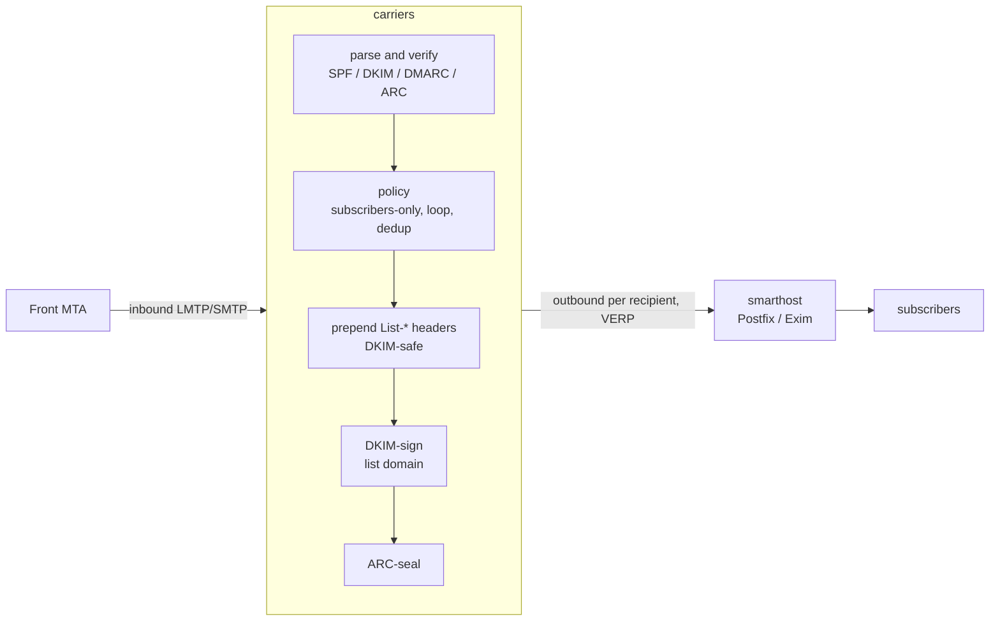

# carriers

A simple mailing list manager written in Rust, built for compliance with **SPF, DKIM, DMARC
and ARC** so that list mail is accepted by large providers (Google, Microsoft, Apple).

## Why DMARC breaks mailing lists — and how carriers stays compliant

A message passes DMARC at the recipient only if an **aligned** authenticator still validates.
Traditional lists break this by editing the body (footers) or the `Subject`, which invalidates
the author's DKIM signature; for domains publishing `p=reject`, the message is then rejected.

carriers avoids that by never modifying a message in a way that breaks DKIM:

1. **Preserve the author's DKIM signature.** The body and existing headers are never rewritten.
   carriers only *prepends* headers, so the author's DKIM signature stays valid and DMARC
   passes at the recipient via **DKIM alignment** (SPF won't align — that is expected and fine).
2. **Add an aligned list DKIM signature** for the list domain.
3. **ARC-seal every message**, recording the SPF/DKIM/DMARC results observed on ingress, so a
   receiver that trusts the sealer can honour the original authentication even if a later hop
   breaks it.
4. **DKIM-breaking features are off by default** (no body footer; the `Subject` prefix is empty
   unless you explicitly opt in and accept it breaks DKIM).

It adds the standard `List-*` headers (RFC 2369), including one-click unsubscribe
(RFC 8058) — all header-only changes that are DKIM-safe.

Built on the battle-tested [Stalwart Labs](https://github.com/orgs/stalwartlabs/repositories)
crates: `mail-auth` (DKIM/SPF/DMARC/ARC), `mail-parser`, `mail-builder`, `mail-send`, and
`smtp-proto`.

## Architecture



- **Ingress**: a minimal LMTP/SMTP listener meant to sit behind a front MTA on a trusted
  interface.
- **Egress**: each copy is relayed to a configured smarthost with a per-recipient **VERP**
  return path (`dev+bounce=user=example.com@lists.example.org`) for bounce attribution. The
  smarthost owns queueing, retries, MX resolution and outbound TLS.
- **Config**: global `carriers.toml` plus one TOML file per list.
- **State**: membership and dedup live in SQLite, behind a `MemberProvider` trait so a future
  pull-based member source can drop in with SQLite as its cache.

The workspace is split into `carriers-core` (the message pipeline, no network) and `carriers`
(the daemon + CLI).

## Quick start

```sh
# 1. Generate DKIM and ARC keys for the list domain (prints the DNS records to publish).
carriers genkey --algorithm ed25519 --selector dkim --domain lists.example.org --out /etc/carriers/keys/dev.dkim.pem
carriers genkey --algorithm ed25519 --selector arc  --domain lists.example.org --out /etc/carriers/keys/dev.arc.pem

# 2. Write config and a list definition (see examples/).
cp examples/carriers.toml   /etc/carriers/carriers.toml
cp examples/lists/dev.toml  /etc/carriers/lists/dev.toml

# 3. Add subscribers.
carriers -c /etc/carriers/carriers.toml member add dev alice@example.com

# 4. Run the daemon.
carriers -c /etc/carriers/carriers.toml run
```

Point your MTA to relay mail for the list address to the carriers `listen` socket (e.g. an LMTP
transport in Postfix), and set carriers' `smarthost` back to that MTA for outbound.

## Running under systemd

Unit files are provided in [`contrib/systemd/`](contrib/systemd/). carriers supports
**socket activation**: when started from a systemd `.socket` unit it adopts the inherited
listening socket, so restarts don't drop the port and the socket can be held open before the
service is ready. Under socket activation the `listen` value in `carriers.toml` is ignored (the
`.socket` unit's `ListenStream=` wins).

```sh
install -Dm755 target/release/carriers /usr/bin/carriers
install -Dm644 contrib/systemd/carriers.socket  /etc/systemd/system/carriers.socket
install -Dm644 contrib/systemd/carriers.service /etc/systemd/system/carriers.service
useradd --system --no-create-home --shell /usr/sbin/nologin carriers
systemctl daemon-reload
systemctl enable --now carriers.socket carriers.service
```

The service is sandboxed (`ProtectSystem=strict`, a managed `StateDirectory=carriers`, a
system-call filter, etc.); keep `db_path = "/var/lib/carriers/carriers.db"` so the database
lives in the writable state directory, and keep config/keys under `/etc/carriers` (read-only to
the service). Running `carriers run` directly (without systemd) simply binds `listen` itself.

## DNS you must publish

For the **list domain** (e.g. `lists.example.org`):

- **DKIM**: the TXT record printed by `carriers genkey` at
  `<dkim-selector>._domainkey.<list-domain>`.
- **ARC**: the TXT record printed by `carriers genkey` at
  `<arc-selector>._domainkey.<list-domain>`.
- **SPF**: authorize your smarthost to send for the list domain, e.g.
  `v=spf1 ip4:<smarthost-ip> -all`.
- **DMARC**: e.g. `v=DMARC1; p=quarantine; rua=mailto:dmarc@lists.example.org`.

The RSA `p=` value is emitted as X.509 SubjectPublicKeyInfo (SPKI), the form Google/Microsoft
expect.

## CLI

| Command | Description |
| --- | --- |
| `carriers run` | Run the ingress listener and distribute posts. |
| `carriers genkey` | Generate a DKIM/ARC key pair and print the DNS record. |
| `carriers member add\|remove\|list <list> [address]` | Manage subscribers. |
| `carriers sync` | Import each list's flat `members_file` into SQLite. |

## Status / roadmap

Implemented: LMTP/SMTP ingress, subscribers-only posting, loop and duplicate suppression,
`List-*` headers, aligned DKIM signing, ARC sealing, VERP envelopes, smarthost delivery,
flat-file lists + SQLite membership, key generation.

Deferred: STARTTLS/implicit TLS on the listener, direct-to-MX delivery, a REST/pull member API,
web archive, digest mode, automated bounce processing, opt-in `Subject`-prefix/footer support.

## License

MPL-2.0.
